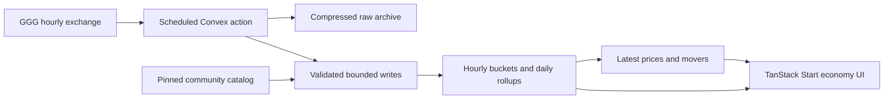

# exile.sh: proposed PoE2 economy plan

Planning draft, 10 September 2026. No application scaffold, account resources, production ingestion, or deployment has been created. Evidence and source links are in [research.md](research.md).

## Product decisions

Confirmed by the owner: MIT-licensed tools site; TanStack Start on Cloudflare Workers + Convex; PoE2 only; exchange economy first; all prices from GGG's documented exchange feed; community names/icons with attribution. Launch with public browsing and device-local favorites. Add GGG login/account sync later; there is no approved application.

Operational settings supplied by the owner:

- Convex project: `exile.sh` (this is the project name, not the team name).
- Development deployment: `next-axolotl-199`; production deployment: `brilliant-rooster-193`.
- Budget: free tiers only for now; do not enable paid resources or overages.
- Collector contact: `hello@natedunn.net`.
- Public GitHub repository: `natedunn/exile.sh`.
- Deployment preference: Cloudflare-managed Git integration and branch-triggered builds, not GitHub Actions deployment.

Pending: Cloudflare account/Worker setup, connected production branch, domain ownership confirmation, and authenticated access to the existing Convex project. Use development for implementation; production is not a test target.

The first tool is **Economy**. Currency categories, market overview, and pair exploration belong inside that tool. Future tools get independent routes and feature modules while sharing the shell, league catalog, item catalog, and eventual identity layer. Do not build a plugin system or speculative tools now.

## Launch experience and parity

| Area              | Proposed v1 behavior                                                                                      |
| ----------------- | --------------------------------------------------------------------------------------------------------- |
| Economy landing   | Useful data immediately: benchmark rates, biggest gainers/losers, and currency table                      |
| Browsing          | Search, category filter, sortable price/change/volume, pagination, shareable URL state                    |
| Categories        | All observed exchange-traded categories, curated from the catalog; unclassified items remain discoverable |
| Denomination      | Exalted default, selectable Chaos/Divine; explicit quote unit everywhere                                  |
| Table history     | Seven-day sparkline, 24h and 7d changes, traded units, source freshness                                   |
| Currency detail   | Hourly price and volume charts, daily rollups, 24h/7d/30d/90d/league ranges, older data loading           |
| Pair explorer     | Search both sides, invert direction, show executed average, both volumes, historical stock measures       |
| Market overview   | Aggregate traded value and active pairs with historical charts; count each exchange pair once             |
| Links             | Item detail and wiki; official trade destination where a verified public navigation URL is available      |
| Favorites         | Device-local for launch; account sync after GGG OAuth is available                                        |
| Data transparency | Definitions, provenance, last completed hour, gaps/backfill status, low-activity labels                   |
| Responsive UI     | Compact desktop table; mobile prioritizes name, price, change and opens details on tap                    |

Parity means comparable exchange analysis, not matching Scout's exact estimates. We will not claim live prices or trade-level OHLC. Show historical stock as such; historical hourly maxima are not a simultaneous order-book snapshot. A “stock value estimate” may be offered with a clear definition after validation; do not call it total market capitalization.

Start with the current softcore challenge league selected. Ingest configured public exchange leagues, separating hardcore/permanent/legacy leagues by exact source identity. Preserve private-league data in raw archives, but do not automatically publish every private league. Maintain a reviewed league manifest until official league service credentials exist. Never infer current league from largest volume or alphabetic order.

## Visual direction

An elegant dark-fantasy trading desk: obsidian backgrounds, smoky stone surfaces, antique brass rules, ivory typography, and a restrained ember accent. Use a distinctive exile.sh wordmark, engraved-style serif headings, and a clean sans-serif with tabular numerals for prices. Currency art supplies rich color; chrome stays quiet.

The official site's atmosphere suggests material depth and ornament. Translate that into fine borders, subtle texture, and a small decorative masthead. Keep controls and tables precise, with ample horizontal space and a strong reading hierarchy. Design original framing and ornaments; use no official logo or copied page assets.

Desktop composition:

```text
exile.sh       Economy                    League ▾    Preferences
────────────────────────────────────────────────────────────────
Economy        Latest completed hour …    Prices in Exalted ▾

Benchmark rates        Trading activity        Data freshness

Rising currencies                   Falling currencies
icon · name · +change · sparkline    icon · name · −change · sparkline

Categories       Search currencies …           Favorites · Sort
                 Name      Price     24h     7d     Volume    Trend
                 …
```

Use emerald and vermilion for movement alongside signed values and arrows. Support keyboard sorting, visible focus, reduced motion, adequate contrast, touch tooltips, and textual chart summaries. No oversized cinematic hero above the working data. First design deliverable during implementation: populated desktop/mobile compositions for overview and currency detail, including stale/empty states.

## Price and trend methodology

All calculations are versioned and reproducible from raw hours. For an item A quoted in B, the direct hourly executed average is `volume(B) / volume(A)` when both volumes are positive. Missing or zero-volume records produce no price observation. Preserve source integers and validate numeric safety; round only at display time.

Prefer a sufficiently active direct market. If absent or too thin, allow a documented one-bridge conversion through Exalted/Chaos/Divine using the same hour and league. Choose a deterministic path with adequate liquidity; store the path and mark the result derived. Do not recursively traverse arbitrary pairs or quietly mix fresh trades with stale conversion rates. Missing conversion means unavailable, not zero.

Use a consistent per-league numeraire for aggregation. Other display denominations use that hour's conversion rate, including historical chart points. The selected numeraire itself is fixed at 1 and excluded from movers. Direct pair charts remain separate from normalized item estimates.

For headline prices, show the latest valid completed-hour observation, its time, and whether it is direct or derived. Latest valid prices may be shown as stale after inactivity, but do not fill graph gaps with invented trades.

For movers, compare volume-weighted three-hour windows ending at the latest completed hour and 24 hours earlier; offer a seven-day comparison too. Daily aggregates sum price-times-traded-units and traded-units before division. Do not average hourly averages without weights. Label the smoothing so table changes and ranking calculations agree.

```text
changePercent = 100 × (recentWindowPrice / comparisonWindowPrice − 1)
```

Initial eligibility proposal: at least two valid hours in each comparison window, at least 12 active hours in the last day, a recent last observation, and configurable minimum traded value in both windows. Calibrate the notional threshold against a multi-day sample before launch; do not hard-code one item-count cutoff for cheap shards and expensive currencies. Exclude zero/missing baselines, unpriced conversions, and newly seen items without history. Show those under “New / insufficient history” instead.

Each mover shows percent and absolute change, traded volume, quote unit, and mini chart. Compare within one league and denomination. Make clear that relative movement can reflect changes in the quote currency. Internal confidence is based on coverage/liquidity/path provenance, not an unexplained statistical score.

## Application architecture

Use TanStack Start on Cloudflare Workers for routes, SSR, shared layout, and server endpoints; Convex for indexed app data, scheduled ingestion, derived read models, and eventual account preferences. Use the kitcn cRPC/ORM conventions from the installed skill for implementation, with bounded queries and explicit public/private/authenticated procedures. Confirm the compatible package set in an initial spike.

Use Cloudflare's supported Vite/Workers integration, a pinned compatibility date, and the current recommended Node compatibility configuration. Test SSR and auth-adapter imports inside workerd before committing to package versions. Convex remains a separate managed backend. Keep one ingestion scheduler in Convex; do not add a second Worker cron collector. Configure public cache behavior separately from future personalized responses. [Cloudflare TanStack Start guide](https://developers.cloudflare.com/workers/framework-guides/web-apps/tanstack-start/)



Archive in Convex file storage initially; retain an adapter boundary for object storage if the hosting budget favors it. UI reads compact published results; visitors never trigger upstream GGG requests. Subscribe to small current snapshots where useful; fetch historical windows on demand. Load chart code only on routes that need it.

## Proposed Convex schema

These are logical entities and index requirements, not a final schema implementation. Use compact sideA/sideB structures rather than raw metadata paths as object keys.

| Entity               | Contents                                                                                 | Primary access/index                          |
| -------------------- | ---------------------------------------------------------------------------------------- | --------------------------------------------- |
| `leagues`            | Exact GGG name, slug, mode, lifecycle, visibility, default quote                         | realm + source name; slug                     |
| `catalogVersions`    | Source URL/hash, game version, imported time                                             | source + hash                                 |
| `items`              | Metadata ID, slug, name, aliases, category, icon, catalog version                        | realm + metadata ID; category; name search    |
| `markets`            | League, original market ID, ordered item IDs                                             | league + source market ID; league + each side |
| `ingestionStreams`   | Realm, forward/backfill cursors, lease, retry time, failures                             | stream key                                    |
| `ingestionHours`     | Requested/next cursor, archive ID/hash, counts, chunk progress, status                   | realm + hour                                  |
| `marketDayBuckets`   | At most 24 hourly slots: both volumes, stock/ratio data, presence flags                  | league + market + UTC day                     |
| `itemDayBuckets`     | At most 24 derived prices, weights, paths, quality flags, method version                 | league + item + UTC day + version             |
| `itemDaily`          | Weighted mean, first/last hourly estimate, extrema of hourly estimates, volume, coverage | league + item + day + version                 |
| `marketDaily`        | Pair volume sums, rate aggregates, coverage, historical stock extrema                    | league + market + day + version               |
| `economyGenerations` | Completed-through hour, methodology version, publication status                          | league + generation                           |
| `latestPrices`       | Per-item table data, precomputed changes/sparkline, freshness, quality                   | league + generation + category + sort value   |
| `moverSnapshots`     | Small ranked gain/loss lists per quote and period                                        | league + generation + quote + period          |
| `marketSummaries`    | Once-per-pair valued turnover, coverage, active pairs per hour/day                       | league + time + resolution                    |
| `watchlists` (later) | Authenticated owner + item IDs; optional league preferences                              | owner; owner + item                           |

Logical uniqueness is enforced in transactional indexed upserts, not assumed from an index declaration. Store UTC epoch seconds consistently and convert in the UI. Bucket slots distinguish unprocessed, processed-with-no-trades, valid, and invalid data; a separate completed-hour ledger distinguishes source inactivity from a collection failure.

Target 90 days of queryable hourly buckets plus daily history for the full league eventually. With the initial free-tier budget, start with a small replay and measure projected monthly usage before enabling sustained ingestion. Initial hourly retention, archive retention, and league coverage must fit measured free allowances; 90 days is not a launch guarantee. Keep compressed raw archives for replay within that allowance. Older leagues can remain browsable from daily rollups where retained. An “all history” chart reports actual available coverage. Never claim recovery beyond source availability.

## Ingestion and operational behavior

1. Acquire a per-stream lease. Fetch after the hourly boundary using a descriptive contact User-Agent. One scheduled collector serves all configured leagues.
2. Respect cache and rate-limit headers; persist `Retry-After`/next allowed time. On 429 pause; on transient failures use capped backoff with jitter; repeated invalid requests open a circuit breaker.
3. Save the raw response with hash and requested hour. Validate shape, identifiers, numbers and cursor progression. Quarantine suspicious data with a recorded reason.
4. Process in bounded, idempotent chunks; retain zero-volume records as observations without treating them as prices. Unknown metadata remains ingestible.
5. Compute hourly estimates and affected daily rollups. Produce a staged league generation of latest prices and movers. Publish the generation pointer only after all required pieces succeed.
6. Advance the checkpoint after durable completion. Retries and overlapping cron runs must not duplicate volume or publish partial rankings. A watchdog resumes expired leases and interrupted work.
7. At stream end, wait until the next hourly boundary. Handle an empty page with an advancing cursor as a valid processed hour.

Prioritize live collection and a recent seven-day backfill, then current-league history at a conservative bounded rate. Separate backfill checkpoints prevent old data from replacing the latest generation. Support interruption/resume and expose coverage. No full multi-year crawl during initial setup.

Benchmark a seven-day replay before broadening retention: document count/size, database I/O, action duration, archive size, and indexed query latency. Bucketing reduces document/index overhead but repeated updates still cost I/O; do not assume the free tier will cover production history. Budget and actual measured volume determine retention expansion.

## GGG login and configuration

Proposed flow when approval exists: GGG authorization code + PKCE → server token exchange → `/profile` UUID mapping → app session through the chosen Convex-compatible auth adapter. Use Better Auth generic OAuth as the first candidate, with an explicit no-email compatibility test. Disable implicit cross-provider account linking. Store tokens only if needed, encrypted and server-side. Account deletion removes preferences and retained credentials.

Launch with public browsing and local preferences. Keep GGG sign-in unavailable until application approval and a tested integration exist; it is not a v1 release blocker.

| Needed                                                         | When                                   | Where                                                          |
| -------------------------------------------------------------- | -------------------------------------- | -------------------------------------------------------------- |
| Convex team/project selection and CLI login                    | Backend setup                          | Owner account; agent can then configure the selected project   |
| Cloudflare account, Worker name and domain                     | Frontend deployment                    | Owner account and Worker configuration                         |
| `CONVEX_DEPLOYMENT`, `VITE_CONVEX_URL`, `VITE_CONVEX_SITE_URL` | Backend setup                          | Local environment and hosting configuration                    |
| `SITE_URL` / public site URL                                   | Frontend deployment                    | Framework/auth configuration                                   |
| `GGG_CONTACT` and descriptive collector User-Agent             | Before sustained ingestion             | Server configuration                                           |
| `GGG_CLIENT_ID`, `GGG_CLIENT_SECRET`                           | Only after GGG approves an application | Server secrets; never public `VITE_*` variables                |
| Stable HTTPS development/production callback URLs              | OAuth registration/testing             | Owned domains and GGG registration                             |
| Auth secret/JWKS required by selected adapter                  | Auth setup                             | Generated securely; deployment secrets                         |
| Deployment credentials                                         | Cloudflare build setup                 | Cloudflare-managed build secrets; no GitHub Actions deployment |

The exchange feed and RePoE need no API key. Commit a placeholder `.env.example`; actual credentials stay in ignored local files or deployment secret stores. Contributors get deterministic fixture mode and an isolated backend; never point forks or tests at production.

Use the existing `exile.sh` Convex project rather than creating a replacement. Configure the collector contact as `hello@natedunn.net`. During deployment setup, connect the repository through Cloudflare and choose the production branch there. Establish how Convex backend deployment runs before frontend publication in that build flow; keep production credentials out of untrusted preview builds. The Worker and Git integration are not configured yet.

## Delivery sequence and acceptance

1. **Review the plan.** Core scope, Workers hosting, MIT, launch without login, existing Convex deployments, and free-tier budget are settled. Collect remaining domain/account access details at setup. Agree on the plan before application construction.
2. **Foundation and data spike.** Scaffold Start/Convex, install official Convex guidance, verify package compatibility, import catalog, replay several real hours, and measure costs. Exit: known rate example is correct, zero-volume hours remain unpriced, retry produces identical results.
3. **Durable history.** Implement archive, checkpoints, compact schema, rollups, publication generations, and bounded backfill. Exit: interrupt/resume and overlapping-run tests pass; gaps and league boundaries remain distinct.
4. **Economy UI.** Deliver original visual system, overview, table/search/categories, currency charts, and movers. Exit: desktop/mobile review, accessible sorting/chart summaries, shareable filters, stale/empty/error states.
5. **Exchange parity and release.** Pair explorer, market history, methodology page, attribution, contributor docs, license, CI, public repository, production configuration. Exit: seven-day replay cost review, no duplicate turnover, browser smoke tests, no secrets, correct recovery after source outage.
6. **GGG account sync when available.** OAuth end-to-end on registered HTTPS domain, account isolation tests, optional local-watchlist import, logout and deletion. This follows public v1 and is not a launch gate.

High-value tests cover inverse quotes, denominator-zero handling, same-hour conversion, weighted rollups, ranking exclusions, source gaps, duplicate replay, partial publication, and future auth ownership. Integration tests run against fixtures/local deployment; CI must not repeatedly call GGG.

Open-source release includes setup/contribution instructions, methodology and provenance, separate game-asset notices, an example environment, and a security contact. Keep third-party artwork outside the source-code license grant. The owner has authorized publishing the planning repository now; application hosting remains an implementation step.
